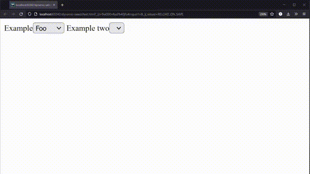

# Dynamic selection boxes in Javascript
This is a library to help easily set-up dynamic select-boxes. A dynamic select-box's choices depend on the value of another select-box. This helps you configure these boxes using simple Javascript objects. It is client-side, so your boxes will work without reloading the browser.
<br/>
### Installation
The preffered way is to use jsdelivr. Simply add this to your html:
```html
<script src="https://cdn.jsdelivr.net/npm/dynamic-select/main.js"></script>
```

You can use a bundler if you would like to. Just install the dynamic-select [npm package](https://www.npmjs.com/package/dynamic-select).
```
npm i dynamic-select
```
### Documentation
Visit the [wiki](https://github.com/tskozel/dynamic-select/wiki) for documentation.

### How it looks in action

